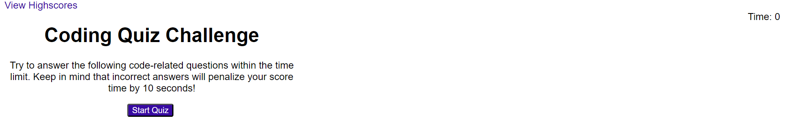

# JavaScript-Code-Quiz

## Description

A timed quiz on JavaScript fundamentals that stores high scores.

## Installation

N/A

## Usage

To take this quiz, open ([Javascript Code Quiz](https://lexigeller.github.io/JavaScript-Code-Quiz/)) in a browser. Click the "Start Quiz" button to begin the quiz. A timer will start at 75 seconds and count down. Click the buttons to answer each question. When you answer, the quiz will display if the selected answer is correct or wrong. If the question has been answered incorrectly, time will deduct from the timer. The quiz will end when all questions have been answered or time has run out on the timer.

After the quiz ends, a score will be displayed. The score can be logged with initials to a list of highscores. All highscores can be viewed.

## Credits

N/A

## License

Please refer to the LICENSE in the repo.
